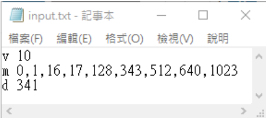
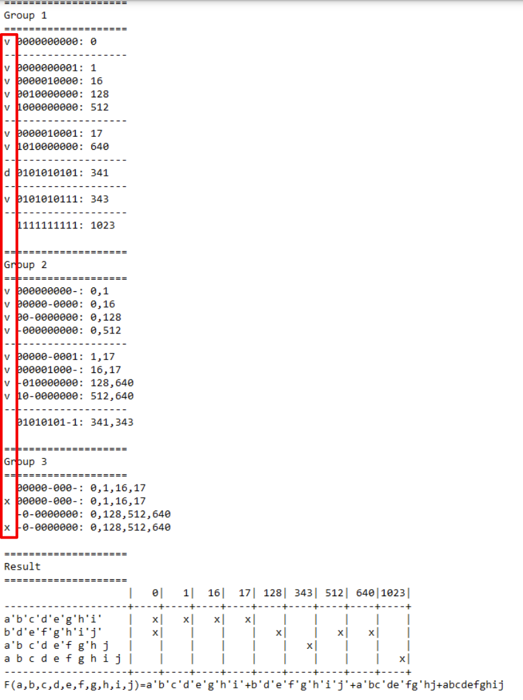

# A Simple CAD Tool Based on Quine-McCluskey Method

## 1. Description
- This assignment is to let students know how to automate the process taught on textbook by writing a program of Quine-McCluskey.
- This program should be able to handle 8~10 variables.
- The prime implicant chart should be output to the designated file.
- This program should also output the Minimum SOP (Sum of Product).

## 2. Requirement

### 1. Read the input file
Your program should read the input file named `input.txt` containing minterm and don’t care term information:
- `v [Variable number]`: Variable number, range (8~10)
- `m [index,index …]`: Minterm value index, range(0~2^v-1)
- `d [index,index …]`: Don’t care index, range(0~2^v-1)

Variable number (v), minterm value indexes (m), don’t-care indexes (d) would be in three different lines.
Between `v`, `m`, `d` and following value(s) would be separated by a space. Each index would be separated by a single comma with no space.
Example: `F(A, B, C, D, E, F, G, H, I, J) = Σ m(0,1,16,17,128,343,512,640,1023) + Σ d(341)`

### 2. Divide the minterms into groups and compare adjacent groups
You can use arrays to store the different groups of minterms and allocate new arrays to store the result of previous comparison.

### 3. Write the output file
You should show the process of comparison and the prime implicant chart in the output file. Taking the above input for example:
- Shows process of grouping with `v` for used, `d` for don’t care and `x` for repeated.
- Shows result and minimum SOP.

## 3. Specification
- This assignment can be finished in C, C++ or Java.
- **Requirement Summary**:
  - Read an input file named `input.txt`
  - Write an output file named `output.txt`
  - Both input and output files should be put under the same directory as the program is.
