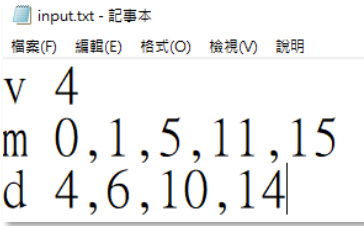
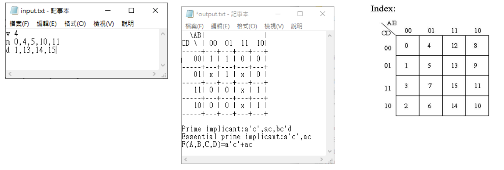
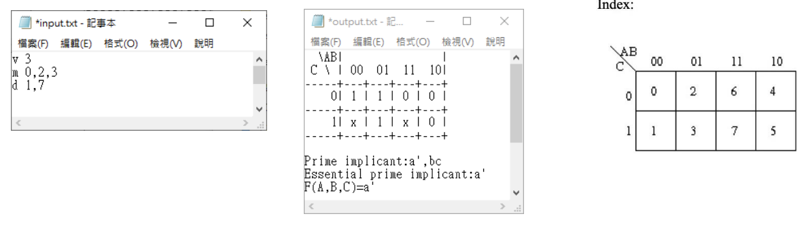
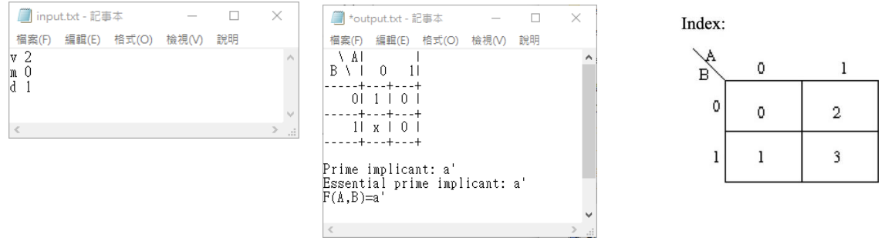
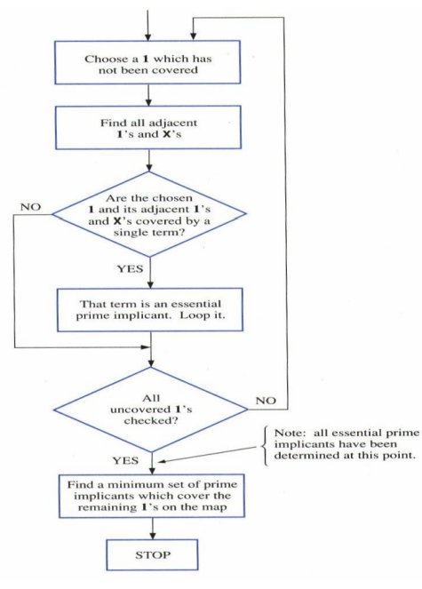

# A Simple CAD Tool Based on K-map

## 1. Description
- This is to automate the process taught on the textbook by writing a program of K-map.
- This program should be able to handle 2~4 variables.
- The prime implicants and the essential prime implicants of the K-map should be indicated.
- This program should also show the Minimum SOP (Sum of Product).

## 2. Requirement

### 1. Read the input file (Use the format below)
Your program should read the input file named `input.txt` containing minterm and don’t care term information:
- `v [Variable number]`: Variable number, range (2~4)
- `m [index,index …]`: Minterm value index, range (0~2^v -1)
- `d [index,index …]`: Don’t care index, range (0~2^v -1)

Variable number (v), minterm value indexes (m), don’t-care indexes (d) would be in three different lines.
Between `v`, `m`, `d` and following value(s) would be separated by a space.
Each index would be separated by a single comma with no space.
Example: `F(A, B, C, D) = Σm(0,1,5,11,15) + Σ d(4,6,10,14)`

### 2. Initialize the terms in the K-map
Create one two-dimensional array to allocate all the 1’s, 0’s and X’s (don’t care) terms of K-map.

### 3. Write the output file (Use the format below)
What you need to print in the output file:
- K-map
- Prime implicant
- Essential prime implicant
- Minimum SOP

Test cases:
1. 4-variable

2. 3-variable

3. 2-variable

## 3. Specification
- This assignment can be finished in C, C++ or Java.

### Requirement Summary:
- Read an input file named `input.txt`
- Write an output file named `output.txt`
- Both input and output files should be put under the same directory as the program is.

## 4. Structure

